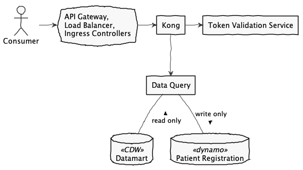

# health-apis-data-query

Health APIs Data Query application. The system consists of
[Spring Boot](https://spring.io/projects/spring-boot) microservices that provide
[Argonaut Data Query](http://www.fhir.org/guides/argonaut/r2/profiles.html) and [FHIR STU3](http://www.hl7.org/fhir/STU3/) compliant resources backed by information from the Corporate Data Warehouse.

###### Modules
- [data-query](data-query/README.md) - Data Query experience API providing specification compliant resources
- [data-query-tests](data-query-tests/README.md) - Integration tests
- data-query-ids-mapping - Provides short hand resource mappings for [ID encoding](https://github.com/department-of-veterans-affairs/health-apis-ids).
- data-query-patient-registration - Provides Spring components to intercept requests and perform patient registration.

#### System Components

Like all Lighthouse APIs, traffic from the consumer moves through the VA networking components, API Gateway, load balancers, etc. before reaching this API. The API Gateway handles authentication and rate limiting before traffic is received by Data Query components.
- **Kong**  
  An instance of the [Health APIs Kong](https://github.com/department-of-veterans-affairs/health-apis-kong) is deployed with Data Query to perform authorization. It is responsible for token validation, SMART-on-FHIR OAuth scope enforcement, etc. Data Query itself is inaccessible except via the authorization Kong instance.
- **Data Query**  
  Data Query processes consumer requests. As part of requests, usage data will be recorded in an Amazon Dynamo table to be used for metrics reporting.
- **Datamart**  
  A database within the Corporate Data Warehouse provides read-only data for Data Query. Nightly ETL processes gather and preprocess data that originates in VistA. 

----

## Building
- [PlantUml](http://plantuml.com/) for diagrams
- Recommended [IntelliJ](https://www.jetbrains.com/idea/)
  or [Eclipse](https://www.eclipse.org/downloads/packages/installer)
  with the following plugins
  - [Lombok](https://projectlombok.org/)
  - [Google Java Format](https://github.com/google/google-java-format)
- [git-secrets](https://github.com/awslabs/git-secrets)

See [health-apis-parent](https://github.com/department-of-veterans-affairs/health-apis-parent) for specifics of the dependency hierarchy.

#### Maven
- Formats Java, XML, and JSON files
  (See the [Style Guide](https://google.github.io/styleguide/javaguide.html))
- Enforces unit test code coverage
- Performs [Checkstyle](http://checkstyle.sourceforge.net/) analysis using Google rules
- Performs [SpotBugs](https://spotbugs.github.io/) analysis
  with [Find Security Bugs](http://find-sec-bugs.github.io/) extensions
- Enforces Git branch naming conventions to support Jira integration

The above build steps can be skipped for use with IDE launch support by disabling the
_standard_ profile, e.g. `mvn -P'!standard' package`

#### git-secrets
git-secrets must be installed and configured to scan for AWS entries and the patterns in
[.git-secrets-patterns](.git-secrets-patterns). Exclusions are managed in
[.gitallowed](.gitallowed).
The [init-git-secrets.sh](src/scripts/init-git-secrets.sh) script can be used to simply set up.

> ###### Mac users
> If using [Homebrew](https://brew.sh/), use `brew install --HEAD git-secrets` as decribed
> by [this post](https://github.com/awslabs/git-secrets/issues/65#issuecomment-416382565) to
> avoid issues committing multiple files.

----

## Running

###### Configuration
The spring application requires an
[external configuration](https://docs.spring.io/spring-boot/docs/current/reference/html/boot-features-external-config.html)
for environment specific information, such as database connection URLs. In production or
production-like environments, configuration is stored in AWS S3 buckets. In local developer
environments, configuration can be `config/` directories that are not maintained in Git. See
a teammate for connection details to shared databases, etc.

See the [configuration guide](configuration.md) for configuring applications in AWS.

----

## Tools
`src/scripts` provides tools to support development activities.

> Review each script before running to ensure you understand exactly what it does.

- `init-git-secrets.sh`
  Initializes your clone of this repository to work with git secrets.
