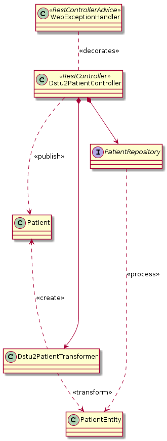

# data-query - Argonaut Data Query

Spring Boot implementation of the 
[FHIR Argonaut Data Query specification](http://www.fhir.org/guides/argonaut/r2/profiles.html).
 

## Design

Data-query is implemented as a series of resource-specific components the follow the template below.
To make the description more complete, the pattern is shown for _Patient_, but it is replicated
for each resource.

##### Components
- `WebExceptionHandler` - Provides common error handling for resource controllers. It will map
  exceptions to `OperationOutcome` payloads with
  appropriate HTTP status codes.
- `${Resource}` - The Argonaut Data Query model for a specific resource, e.g. `Patient` or `DiagnosticReport`.
- `${Resource}${Version}Root` - A versioned CDW schema JAXB model for the XML root element that will
  be used for XML unmarshalling, e.g `Patient103Root`. This class is generated from CDW schemas.
- `${Resource}Controller` - Spring Rest Controller responsible for a given resource type. Resource
  controllers orchestrate requests and conversion to data query types.
- `${Resource}Controller.Transformer` - An functional interface to transform a CDW XML model type to
  a Argonaut data query model type.
- `${Resource}Transformer` - The implementation of a resource-specific controller's Transformer
  interface. This class provides the logic for converting the CDW data type into Argonaut models.
